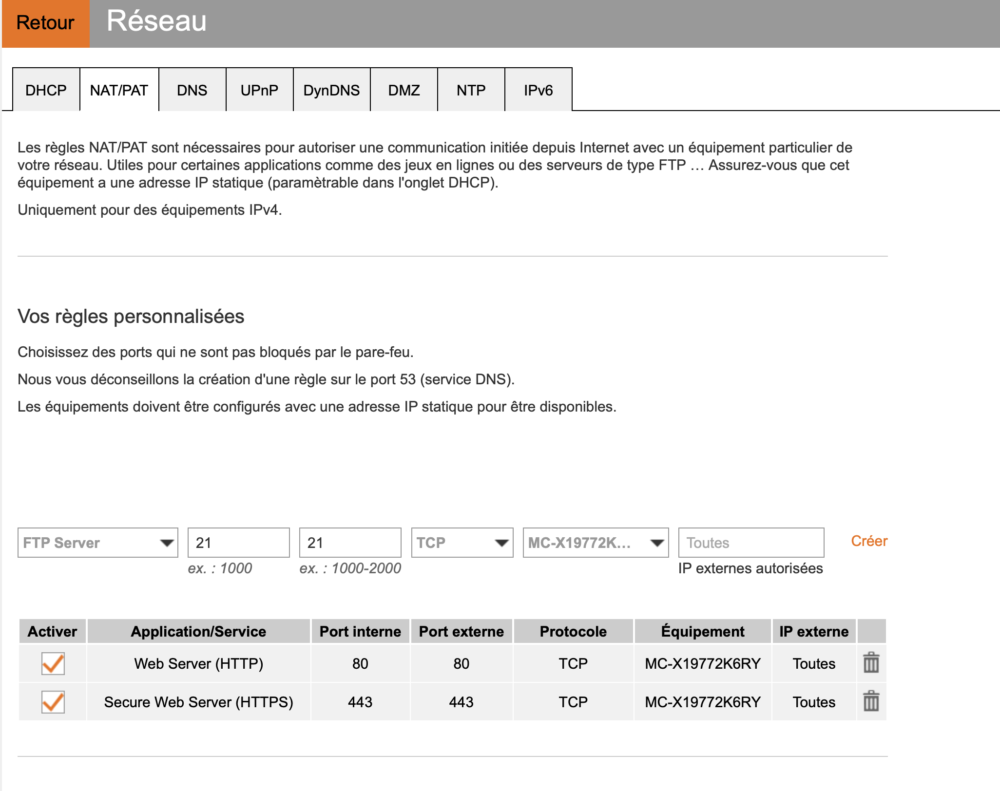

# Certificate management with Traefik and certmanager

This document explaine how to deploy traefik on a local kubernetes like minukube, Kubernetes Rancher Desktop (without traefik deployment), Docker Desktop

## Prequisites

* **kubernetes** version >= 1.22
* **Helm** v3 > 3.9.0 

### DNAT set in your internet box access

You must declare a DNAT into your internet box to expose the ports 80 and 443 of your desktop to internet.

### Example on Orange LiveBox



## Without certmanager

### Deployment

#### Deploy Traefik

* Add traefik helm repository

```shell
helm repo add traefik https://traefik.github.io/charts
```

Update the file **values/traefik-values-without-certmanager.yml** with your personal mail (line 51)

* Deploying Traefik

```shell
helm install --atomic -n traefik-system --create-namespace  -f values/traefik-values-without-certmanager.yml traefik traefik/traefik
```

#### Check deployment

* List all Traefik kubernetes objects

```shell
kubectl -n traefik-system get all
```

```log
NAME                           READY   STATUS    RESTARTS   AGE
pod/traefik-7cc96cc545-q2g67   1/1     Running   0          47s

NAME              TYPE           CLUSTER-IP      EXTERNAL-IP    PORT(S)                                     AGE
service/traefik   LoadBalancer   10.43.232.197   192.168.5.15   9000:31495/TCP,80:31780/TCP,443:32579/TCP   47s

NAME                      READY   UP-TO-DATE   AVAILABLE   AGE
deployment.apps/traefik   1/1     1            1           47s

NAME                                 DESIRED   CURRENT   READY   AGE
replicaset.apps/traefik-7cc96cc545   1         1         1       47s
```

* Test http redirectTo
  
```shell
curl http://my-domain.example.com -v
```

```log
*   Trying 2.10.xxx.xxx:80...
* Connected to localhost (2.10.xxx.xxx) port 80 (#0)
> GET / HTTP/1.1
> Host: localhost
> User-Agent: curl/8.1.2
> Accept: */*
> 
< HTTP/1.1 301 Moved Permanently
< Location: https://my-domain.example.com/
< Date: Sun, 05 Nov 2023 13:02:43 GMT
< Content-Length: 17
< Content-Type: text/plain; charset=utf-8
< 
* Connection #0 to host localhost left intact
```

* Test https access

```shell
curl https://my-domain.example.com -vk
```

```log
*   Trying 2.10.xxx.xxx:443...
* Connected to localhost (2.10.xxx.xxx) port 443 (#0)
* ALPN: offers h2,http/1.1
* (304) (OUT), TLS handshake, Client hello (1):
* (304) (IN), TLS handshake, Server hello (2):
* (304) (IN), TLS handshake, Unknown (8):
* (304) (IN), TLS handshake, Certificate (11):
* (304) (IN), TLS handshake, CERT verify (15):
* (304) (IN), TLS handshake, Finished (20):
* (304) (OUT), TLS handshake, Finished (20):
* SSL connection using TLSv1.3 / AEAD-CHACHA20-POLY1305-SHA256
* ALPN: server accepted h2
* Server certificate:
*  subject: CN=TRAEFIK DEFAULT CERT
*  start date: Nov  5 13:00:38 2023 GMT
*  expire date: Nov  4 13:00:38 2024 GMT
*  issuer: CN=TRAEFIK DEFAULT CERT
*  SSL certificate verify result: unable to get local issuer certificate (20), continuing anyway.
* using HTTP/2
* h2 [:method: GET]
* h2 [:scheme: https]
* h2 [:authority: localhost]
* h2 [:path: /]
* h2 [user-agent: curl/8.1.2]
* h2 [accept: */*]
* Using Stream ID: 1 (easy handle 0x15880f400)
> GET / HTTP/2
> Host: localhost
> User-Agent: curl/8.1.2
> Accept: */*
> 
< HTTP/2 404 
< content-type: text/plain; charset=utf-8
< x-content-type-options: nosniff
< content-length: 19
< date: Sun, 05 Nov 2023 13:05:55 GMT
< 
404 page not found
* Connection #0 to host localhost left intact
```

### Generate new application certiifcate

#### Deploy application and service

```shell
kubectl apply -f manifestes/deploy-app.yml
```

#### Create ingress access

Update the file **manifestes/ingress-without-certmanager.yml** with your personal domain and apply to kubernetes

```shell
kubectl apply -f manifestes/ingress-without-certmanager.yml
```

#### Check new certifcate

* Check access to https server

```shell
curl https://my-domain.example.com -Ikv
```

```log
*   Trying 2.10.xxx.xxx:443...
* Connected to example.david.orangeadd.com (2.10.xxx.xxx) port 443 (#0)
* ALPN, offering h2
* ALPN, offering http/1.1
* TLSv1.3 (OUT), TLS handshake, Client hello (1):
* TLSv1.3 (IN), TLS handshake, Server hello (2):
* TLSv1.3 (IN), TLS handshake, Encrypted Extensions (8):
* TLSv1.3 (IN), TLS handshake, Certificate (11):
* TLSv1.3 (IN), TLS handshake, CERT verify (15):
* TLSv1.3 (IN), TLS handshake, Finished (20):
* TLSv1.3 (OUT), TLS change cipher, Change cipher spec (1):
* TLSv1.3 (OUT), TLS handshake, Finished (20):
* SSL connection using TLSv1.3 / TLS_AES_128_GCM_SHA256
* ALPN, server accepted to use h2
* Server certificate:
*  subject: CN=my-domain.example.com
*  start date: Nov  5 14:07:33 2023 GMT
*  expire date: Feb  3 14:07:32 2024 GMT
*  issuer: C=US; O=(STAGING) Let's Encrypt; CN=(STAGING) Artificial Apricot R3
*  SSL certificate verify result: unable to get local issuer certificate (20), continuing anyway.
* Using HTTP2, server supports multiplexing
* Connection state changed (HTTP/2 confirmed)
* Copying HTTP/2 data in stream buffer to connection buffer after upgrade: len=0
* Using Stream ID: 1 (easy handle 0x7f979700fc00)
> HEAD / HTTP/2
> Host: my-domain.example.com
> user-agent: curl/7.81.0
> accept: */*
> 
* TLSv1.3 (IN), TLS handshake, Newsession Ticket (4):
* Connection state changed (MAX_CONCURRENT_STREAMS == 250)!
< HTTP/2 200 
HTTP/2 200 
< access-control-allow-credentials: true
access-control-allow-credentials: true
< access-control-allow-origin: *
access-control-allow-origin: *
< content-security-policy: default-src 'self'; style-src 'self' 'unsafe-inline'; img-src 'self' camo.githubusercontent.com
content-security-policy: default-src 'self'; style-src 'self' 'unsafe-inline'; img-src 'self' camo.githubusercontent.com
< content-type: text/html; charset=utf-8
content-type: text/html; charset=utf-8
< date: Sun, 05 Nov 2023 15:14:34 GMT
date: Sun, 05 Nov 2023 15:14:34 GMT
< content-length: 10916
content-length: 10916
```